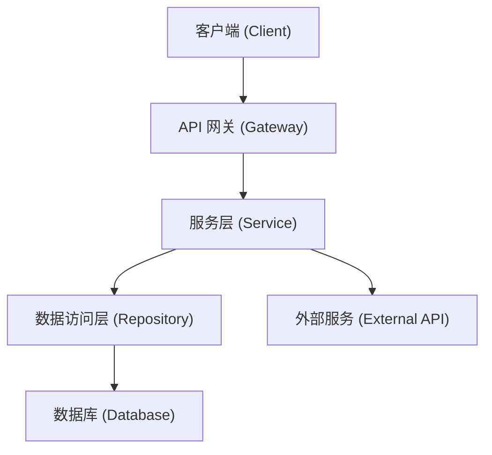
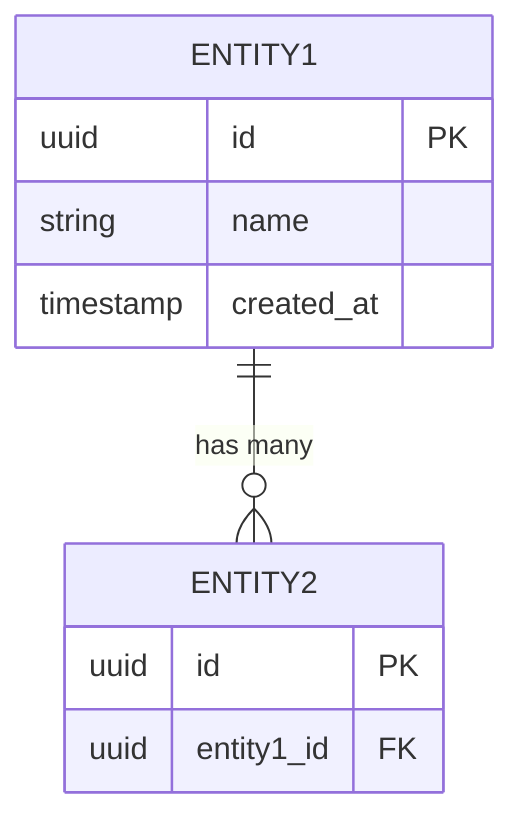

# 架构设计 (Architecture Specification)

> **功能名称：** [功能名称]
> **版本：** v1.0
> **状态：** 草稿 | 审查中 | 已批准
> **关联需求：** `docs/specs/product.md`
> **最后更新：** [日期]

---

## 1. 系统概览

[用 3-5 句话描述该功能的技术实现方案概要，以及它如何融入现有系统架构。]

### 架构决策记录 (ADR)

| 决策 | 选择方案 | 被否定方案 | 理由 |
|:---|:---|:---|:---|
| [决策 1] | [选择的方案] | [被否的方案] | [理由] |
| [决策 2] | [选择的方案] | [被否的方案] | [理由] |

---

## 2. 组件拓扑图



> 请根据实际架构替换上图。使用 Mermaid.js 语法绘制组件间的依赖关系。

---

## 3. 数据模型

### 3.1 实体定义

#### [实体名称 1]

| 字段名 | 类型 | 约束 | 描述 |
|:---|:---|:---|:---|
| `id` | UUID | PK, NOT NULL | 主键 |
| `name` | VARCHAR(255) | NOT NULL | [描述] |
| `created_at` | TIMESTAMP | NOT NULL, DEFAULT NOW | 创建时间 |
| `updated_at` | TIMESTAMP | NOT NULL | 最后更新时间 |

#### [实体名称 2]

| 字段名 | 类型 | 约束 | 描述 |
|:---|:---|:---|:---|
| `id` | UUID | PK, NOT NULL | 主键 |
| `[entity1]_id` | UUID | FK → [entity1].id | 外键关联 |

### 3.2 实体关系图



---

## 4. API / 接口签名

### 4.1 [端点/函数名称]

| 属性 | 值 |
|:---|:---|
| **方法** | `GET` / `POST` / `PUT` / `DELETE` |
| **路径** | `/api/v1/[resource]` |
| **认证** | 必需 / 可选 / 无 |
| **权限** | [所需权限级别] |

**请求参数：**
```json
{
  "field1": "string (required) - 描述",
  "field2": "number (optional) - 描述"
}
```

**成功响应 (200)：**
```json
{
  "data": {
    "id": "uuid",
    "field1": "string"
  }
}
```

**错误响应：**
| 状态码 | 错误码 | 描述 |
|:---|:---|:---|
| 400 | `INVALID_INPUT` | 输入参数校验失败 |
| 401 | `UNAUTHORIZED` | 未认证 |
| 404 | `NOT_FOUND` | 资源不存在 |
| 500 | `INTERNAL_ERROR` | 服务器内部错误 |

---

## 5. 依赖白名单

> 仅允许使用以下依赖。如需引入新依赖，必须在此处添加并获得批准。

| 依赖名 | 版本 | 用途 | 是否新增 |
|:---|:---|:---|:---|
| [依赖 1] | ^x.y.z | [用途] | 否（已有） |
| [依赖 2] | ^x.y.z | [用途] | 是（新增） |

---

## 6. 错误处理策略

| 错误场景 | 处理方式 | 用户感知 |
|:---|:---|:---|
| [场景 1] | [重试 / 降级 / 抛出] | [展示的错误信息] |
| [场景 2] | [重试 / 降级 / 抛出] | [展示的错误信息] |

---

## 7. 安全策略

- **输入验证：** [策略描述]
- **身份认证：** [策略描述]
- **数据访问控制：** [策略描述]
- **敏感数据处理：** [是否涉及 PII，加密方式]
- **审计日志：** [是否需要，记录内容]

---

## 8. 性能考量

| 指标 | 目标值 | 测量方式 |
|:---|:---|:---|
| 响应时间 (P95) | [< xxxms] | [工具/方法] |
| 吞吐量 | [xxx QPS] | [工具/方法] |
| 内存占用 | [< xxxMB] | [工具/方法] |

---

## 9. 审批记录

| 日期 | 审批人 | 决定 | 备注 |
|:---|:---|:---|:---|
| [日期] | [姓名] | 批准/驳回/待修改 | [备注] |
