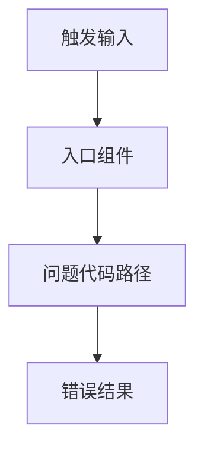

# 修复设计 (Bugfix Design)

> **问题名称：** [问题名称]
> **关联规范：** `docs/specs/bugfix.md`
> **版本：** v1.0
> **状态：** 草稿 | 审查中 | 已批准
> **最后更新：** [日期]

---

## 1. 根因分析

### 1.1 初始假设

- [最初怀疑的根因]

### 1.2 确认后的根因

- [最终确认的根因]
- [证据：日志 / 调试结论 / 测试 / blame / 复现场景]

### 1.3 触发条件

- [输入条件 / 竞态条件 / 环境因素 / 状态组合]

---

## 2. 代码路径与影响面

### 2.1 涉及组件

| 组件 / 文件 | 角色 | 是否修改 |
|:---|:---|:---|
| [模块 1] | [作用] | 是 / 否 |
| [模块 2] | [作用] | 是 / 否 |

### 2.2 路径追踪图

> 请根据实际调用链替换上图。

### 2.3 明确不修改的区域

- [明确保持不动的模块 / 接口 / 数据结构]

---

## 3. 修复策略

### 3.1 最小安全修复方案

- [修复动作]
- [为什么这是最小且足够安全的变更]

### 3.2 被否决的备选方案

| 方案 | 放弃原因 |
|:---|:---|
| [方案 A] | [原因] |
| [方案 B] | [原因] |

---

## 4. 测试与验证策略

### 4.1 复现证明

- [用于证明 bug 存在的 failing test / 集成场景 / 脚本]

### 4.2 修复证明

- [用于证明修复生效的自动化验证]

### 4.3 回归防护

- [用于证明未受影响行为保持不变的测试]

### 4.4 额外验证

- [性能 / 并发 / 数据校验 / 日志确认]

---

## 5. 风险与发布计划

| 风险 | 缓解措施 | 监控方式 |
|:---|:---|:---|
| [风险 1] | [措施] | [日志 / 指标 / 告警] |
| [风险 2] | [措施] | [日志 / 指标 / 告警] |

### 发布 / 回滚说明

- **发布方式：** [正常发布 / 灰度 / 热修复]
- **回滚条件：** [何时需要回滚]
- **回滚步骤：** [回滚方法]

---

## 6. 审批记录

| 日期 | 审批人 | 决定 | 备注 |
|:---|:---|:---|:---|
| [日期] | [姓名] | 批准/驳回/待修改 | [备注] |
