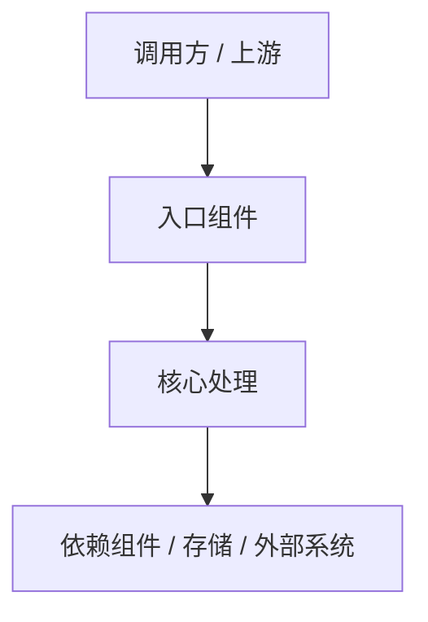

# 技术设计规范 (Design-First Specification)

> **设计名称：** [设计名称]
> **设计粒度：** High Level Design | Low Level Design
> **版本：** v1.0
> **状态：** 草稿 | 审查中 | 已批准
> **最后更新：** [日期]

---

## 1. 设计概述

[用 2-4 句话说明本设计要解决的技术问题、目标能力，以及为什么必须先从设计出发。]

---

## 2. 设计起点与约束

### 2.1 已知设计输入

- [既有架构 / ADR / 接口草案 / 数据模型 / 迁移方案]

### 2.2 强约束

- [性能 / 安全 / 合规 / 兼容性 / 部署约束]

### 2.3 假设

- [仍未证实但暂时采用的设计假设]

---

## 3. 目标系统边界

### 3.1 涉及组件

| 组件 / 模块 | 作用 | 是否变更 |
|:---|:---|:---|
| [组件 1] | [作用] | 是 / 否 |
| [组件 2] | [作用] | 是 / 否 |

### 3.2 明确不在范围内

- [不改动的模块 / 服务 / 数据结构]

---

## 4. 方案设计

### 4.1 总体方案

[描述高层或低层设计方案。]

### 4.2 拓扑 / 调用链

> 请根据实际方案替换上图。

### 4.3 关键接口与数据流

| 接口 / 数据流 | 输入 | 输出 | 约束 |
|:---|:---|:---|:---|
| [接口 1] | [输入] | [输出] | [约束] |
| [接口 2] | [输入] | [输出] | [约束] |

### 4.4 数据模型 / 状态变化

| 对象 / 状态 | 变化前 | 变化后 | 备注 |
|:---|:---|:---|:---|
| [对象 1] | [状态] | [状态] | [说明] |

### 4.5 Low Level Design 细节（仅当设计粒度为 Low Level Design 时必填）

- **模块 / 类职责：** [模块、类、函数或组件的具体职责边界]
- **函数签名与契约：** [关键函数 / 方法签名、输入输出、错误契约]
- **算法流程：** [关键算法步骤、复杂度或顺序约束]
- **状态转换：** [状态机、事件、前置条件和后置条件]
- **详细数据结构：** [字段、索引、缓存键、内存结构或序列化形态]

---

## 5. 备选方案与取舍

| 方案 | 结论 | 原因 |
|:---|:---|:---|
| [方案 A] | 采用 / 放弃 | [原因] |
| [方案 B] | 采用 / 放弃 | [原因] |

---

## 6. 风险与验证策略

### 6.1 主要风险

- [风险 1]
- [风险 2]

### 6.2 验证策略

- [如何验证设计成立]
- [如何验证约束被满足]

---

## 7. 派生需求提示

- [从本设计中将派生出的需求边界]
- [明确不能从本设计派生出的能力]

---

## 8. 审批记录

| 日期 | 审批人 | 决定 | 备注 |
|:---|:---|:---|:---|
| [日期] | [姓名] | 批准/驳回/待修改 | [备注] |
